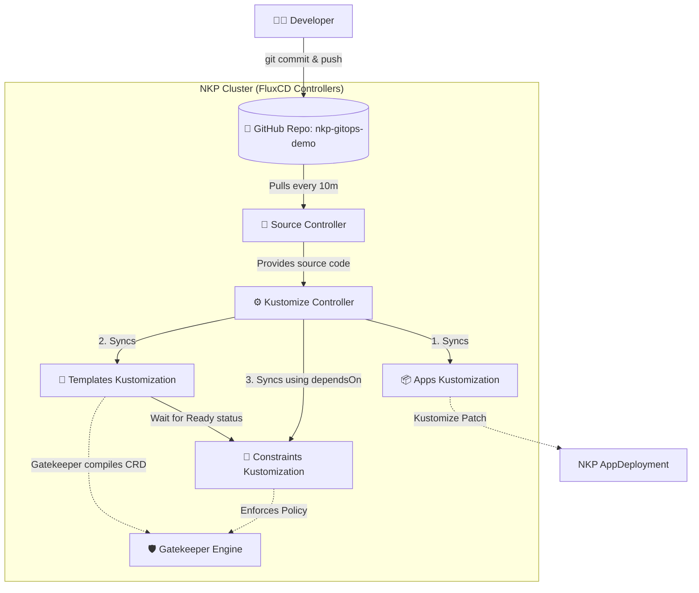

# NKP GitOps & Gatekeeper Demo

> ## ⚠️ Upgrade Disclaimer: Starter to Pro/Ultimate
> This repository defines a GitOps pattern optimized for **NKP Starter**. If you plan to apply a license upgrade to **NKP Pro** or **NKP Ultimate**, please read this carefully.
> 
> **Will anything break if I upgrade?**
> **Immediately? No.** Because we safely isolated your GitOps resources into the `nkp-user-gitops` namespace, the NKP upgrade engine will simply ignore them. Your cluster will not crash, and your Gatekeeper policies will remain active.
> 
> **However, long-term, it will cause a "Split-Brain" management problem.** NKP Pro and Ultimate introduce **Fleet Management** and **Workspaces**. In these tiers, GitOps is managed natively via the NKP UI/CLI at the Workspace level. If you leave this standalone Starter pattern running, your cluster will receive policy updates from a localized Flux deployment that the NKP Management UI knows nothing about. This causes configuration drift and constant overwrites if an admin tries to use the official Workspace GitOps method.
> 
> **The Fix:** Before or immediately after upgrading, delete the local `Kustomization` and `GitRepository` resources in the `nkp-user-gitops` namespace, and seamlessly migrate the repository connection to the official NKP Workspace.
> 
> **Why didn't we just use the `kommander-flux` namespace?**
> If we had put our `GitRepository` and `Kustomization` manifests directly into NKP's native `kommander-flux` namespace, upgrading (or even applying a patch) could **break your cluster**.
> 1. **The Pruning Reaper:** `kommander-flux` is strictly owned by NKP's lifecycle manager. During an upgrade, NKP reconciles that namespace. It will likely delete any unrecognized custom Flux resources, instantly severing your GitOps pipeline.
> 2. **Resource Collisions:** Naming collisions could cause Flux controllers to hang or enter a crash loop, taking down NKP's ability to heal or upgrade core apps (Traefik, Dex, Gatekeeper).
> 3. **AppDeployment Overwrites:** Managing the core `AppDeployment` directly without our safe "patching" method would result in NKP forcefully overwriting our changes and wiping out our custom settings.
> 
> *By using the `nkp-user-gitops` namespace, we successfully "piggyback" on the underlying Flux engine while maintaining total logical isolation from NKP's blast radius.*

---

## 📖 Overview

This repository demonstrates a best-practice GitOps workflow for managing Nutanix Kubernetes Platform (NKP) platform applications and Gatekeeper security policies using FluxCD and Kustomize.

This README and the demo-runbook are meant to demonstrate how to build and recreate "this" repo for yourself. 
I show you how to create this repo in your own environment and link it to you your custom installed flux.cd deployment (that NKP will ignore), and then use that configuration to make minor tweaks and usage of a NKP Starter application called OPA Gatekeeper. 

I will use the files above, in the clusters folder, to test my steps with my application level gitops on NKP Starter, but my demo-runbook gives you the steps you will need to create the contents of the clusters folder in your own empty repo. 

I always find that small iterative demos that provide a general intro to some of the more powerful things in a the smallest package possible to be the ones I like the most for getting started. 

## 🗂️ Repository Structure

To solve Kubernetes "Chicken and Egg" race conditions, this repository is strictly organized into separate directories based on resource dependencies. The root `kustomization.yaml` has been removed to prevent Flux from syncing everything simultaneously.

```text
nkp-gitops-demo/
├── clusters/
│   └── nkp-starter/
│       ├── apps/
│       │   ├── gatekeeper-config.yaml       # ConfigMap with Helm values
│       │   ├── gatekeeper-patch.yaml        # AppDeployment patch
│       │   └── kustomization.yaml           # Kustomize entrypoint (applies patch)
│       ├── templates/
│       │   ├── require-labels-template.yaml # Gatekeeper ConstraintTemplate (The Logic)
│       │   └── kustomization.yaml           # Kustomize entrypoint for templates
│       └── constraints/
│           ├── require-labels-constraint.yaml # Gatekeeper Constraint (The Enforcement)
│           └── kustomization.yaml             # Kustomize entrypoint for constraints
└── README.md
```

### What do the files do?
*   **`apps/gatekeeper-config.yaml`**: Contains a `ConfigMap` with our custom Helm values (e.g., `auditInterval: 300`).
*   **`apps/gatekeeper-patch.yaml`**: A Kustomize patch targeting NKP's default Gatekeeper `AppDeployment`. It safely injects the ConfigMap overrides *without* hardcoding or locking the application version, allowing NKP upgrades to proceed normally.
*   **`templates/...`**: Contains Gatekeeper `ConstraintTemplates`. These contain the underlying Rego code (the logic) for our policies. When applied, Gatekeeper compiles them and dynamically creates new Kubernetes Custom Resource Definitions (CRDs).
*   **`constraints/...`**: Contains Gatekeeper `Constraints`. These are the actual instantiations of the templates (e.g., "Require the `nkp-managed` label on all Namespaces").
*   **`kustomization.yaml`**: Found in every sub-directory. This is the "manifest" that tells Flux exactly which YAML files in that specific folder should be bundled together and applied to the cluster.

---

## 🏗️ Architecture & GitOps Workflow

Below is the workflow of how code moves from this repository into the NKP cluster, utilizing FluxCD's controllers and Kustomize.



### The Technology Stack Explained

#### 1. Kustomize (The Packager & Patcher)
Kustomize is a configuration management tool built into Kubernetes. Instead of using complex Helm templating, Kustomize works by overlaying "patches" on top of raw YAML. 
In this repo, we use Kustomize to dynamically inject a `configOverrides` block into NKP's default Gatekeeper `AppDeployment`. This allows us to change Gatekeeper's settings without overwriting the application version managed by NKP.

#### 2. FluxCD (The GitOps Engine)
FluxCD runs inside the NKP cluster and continuously monitors this Git repository. It consists of two main pieces:
*   **Source Controller**: Connects to GitHub, authenticates, and downloads the latest `main` branch code into the cluster.
*   **Kustomize Controller**: Looks at the downloaded code, runs Kustomize to stitch the YAML files together, and safely applies them to the Kubernetes API.

#### 3. The `dependsOn` Flag (Solving the Race Condition)
Gatekeeper policies introduce a classic "Chicken and Egg" problem:
1. You cannot apply a `Constraint` until the `ConstraintTemplate` has been compiled by Gatekeeper. 
2. If Flux tries to apply both at the same time, the Kubernetes API will reject the `Constraint` because it doesn't recognize the Custom Resource yet, causing a `dry-run failed` error.

**The Solution:** We split the files into the `templates/` and `constraints/` folders. When configuring Flux, we create separate sync jobs and use the `dependsOn` feature:
```bash
flux create kustomization nkp-constraints-sync \
  ...
  --depends-on=nkp-templates-sync
```
This tells Flux: *"Do not even look at the `constraints` folder until the `templates` folder has successfully deployed and reported a healthy, ready status."* 

---

## 🚀 Getting Started

If you are cloning this repository to run on your own NKP cluster, follow these steps to bootstrap the Flux configuration:

1. **Set your credentials:**
   ```bash
   export GITHUB_TOKEN="<your-pat>"
   export GITHUB_USER="<your-username>"
   export REPO_NAME="nkp-gitops-demo"
   ```

2. **Create the Git Source:**
   ```bash
   kubectl create namespace nkp-user-gitops
   flux create secret git github-auth --url=https://github.com/${GITHUB_USER}/${REPO_NAME}.git --username=${GITHUB_USER} --password=${GITHUB_TOKEN} --namespace=nkp-user-gitops
   flux create source git nkp-infra-repo --url=https://github.com/${GITHUB_USER}/${REPO_NAME}.git --branch=main --secret-ref=github-auth --namespace=nkp-user-gitops
   ```

3. **Apply the Apps & Templates:**
   ```bash
   flux create kustomization nkp-apps-sync --source=GitRepository/nkp-infra-repo --path="./clusters/nkp-starter/apps" --prune=true --interval=10m --namespace=nkp-user-gitops
   flux create kustomization nkp-templates-sync --source=GitRepository/nkp-infra-repo --path="./clusters/nkp-starter/templates" --prune=true --interval=10m --namespace=nkp-user-gitops
   ```

4. **Apply the Constraints (with dependsOn):**
   ```bash
   flux create kustomization nkp-constraints-sync --source=GitRepository/nkp-infra-repo --path="./clusters/nkp-starter/constraints" --prune=true --interval=10m --depends-on=nkp-templates-sync --namespace=nkp-user-gitops
   ```

---

## Uninstall

To remove your custom GitOps configurations and policies while leaving the base Gatekeeper installation running, follow these steps:

**1. Remove Flux Kustomizations and Repositories**
Delete the Kustomizations and GitRepository resources that manage your custom Gatekeeper policies through FluxCD. This will remove your policies but keep Gatekeeper active on the cluster:
```bash
kubectl delete kustomization nkp-apps-sync nkp-templates-sync nkp-constraints-sync -n nkp-user-gitops
# Adjust the repository name below if yours is named differently
kubectl delete gitrepository gatekeeper-policies-repo -n nkp-user-gitops
```

**2. Clean Up Configuration Overrides (Optional)**
If you applied custom configuration overrides to the Gatekeeper installation and want to revert to the defaults, delete the ConfigMaps or Secrets:
```bash
kubectl delete configmap gatekeeper-overrides -n nkp-user-gitops
# Or if a Secret was used:
# kubectl delete secret gatekeeper-overrides -n nkp-user-gitops
```

**3. Verify Removal**
Ensure that the Flux Kustomizations for apps, templates, and constraints have been successfully removed. Running these commands should return a "NotFound" error to confirm they are gone:
```bash
kubectl get kustomizations.kustomize.toolkit.fluxcd.io nkp-apps-sync -n nkp-user-gitops
kubectl get kustomizations.kustomize.toolkit.fluxcd.io nkp-templates-sync -n nkp-user-gitops
kubectl get kustomizations.kustomize.toolkit.fluxcd.io nkp-constraints-sync -n nkp-user-gitops
```

## ✅ Verification

### 1. Verify the GitOps Sync (FluxCD)
To ensure Flux successfully pulled and applied your code, run the following commands:

```bash
# View the status of all Flux Kustomizations
flux get kustomization -n nkp-user-gitops

# View the specific status and commit hash for the constraints sync
flux get kustomization nkp-constraints-sync -n nkp-user-gitops

# View the exact "receipt" (inventory) of Kubernetes objects Flux successfully created
kubectl get kustomizations.kustomize.toolkit.fluxcd.io nkp-constraints-sync -n nkp-user-gitops -o yaml | grep -A 15 "inventory:"
```
*(Note: Replace `nkp-constraints-sync` with `nkp-apps-sync` or `nkp-templates-sync` to check the inventory of the other directories).*

#### 🕵️ Interpreting the Output (What to look for)
*   **READY: False**
    If `flux get kustomization` shows `READY: False`, Flux hit an error and stopped executing. Look at the `MESSAGE` column; it will tell you exactly what failed (e.g., a YAML syntax error, or a missing CRD from a dry-run failure).
*   **Mismatched Revisions (`lastAppliedRevision` vs `lastAttemptedRevision`)**
    When checking the YAML output, you might see two different Git commit SHA hashes. 
    *   `lastAttemptedRevision`: The newest commit Flux *tried* to apply.
    *   `lastAppliedRevision`: The last commit Flux *successfully* applied. 
    If these hashes do not match, it means your newest commit contains a breaking error! Flux safely halted the deployment and left your cluster in the last known good state.
*   **Empty Inventory (`entries: []`)**
    If the `inventory:` list is completely empty but Flux says `READY: True`, it means Flux found your directory but didn't deploy anything. This almost always means your `kustomization.yaml` file in that folder is missing, or you forgot to list your YAML files under the `resources:` block inside of it.

### 2. Verify Gatekeeper Policy Enforcement
Check that the policy is actively evaluating namespaces.

```bash
# View all existing namespaces and their current labels to see what is compliant/non-compliant
kubectl get namespaces --show-labels

# Test REJECTION: Attempt to create a non-compliant namespace
kubectl create namespace test-bad-ns
# EXPECTED: Error from server (Forbidden): admission webhook "validation.gatekeeper.sh" denied the request...
```

