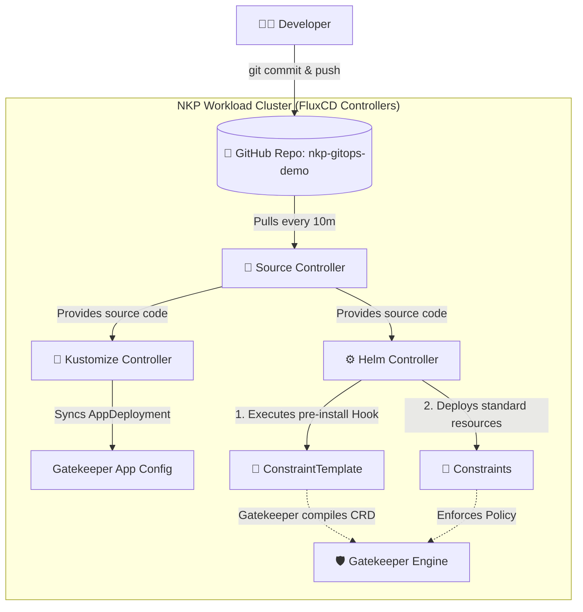

# NKP GitOps & Gatekeeper Demo

> ## ⚠️ Upgrade Disclaimer: Starter to Pro/Ultimate
> This repository defines a GitOps pattern optimized for **NKP Starter**. NKP Starter setups typically consist of a Management cluster and attached Workload clusters. Because Starter does not include Workspace Fleet Management, we apply these resources locally to the target cluster.
> 
> If you plan to apply a license upgrade to **NKP Pro** or **NKP Ultimate**, please read this carefully.
>
> **Will anything break if I upgrade? Immediately? No.** Because we safely isolated your GitOps resources into the `nkp-user-gitops` namespace, the NKP upgrade engine will simply ignore them. Your cluster will not crash, and your Gatekeeper policies will remain active.
>
> **However, long-term, it will cause a "Split-Brain" management problem.** NKP Pro and Ultimate introduce **Fleet Management** and **Workspaces**. In these tiers, GitOps is managed natively via the NKP UI/CLI at the Workspace level. If you leave this local Starter pattern running, your cluster will receive policy updates from a localized Flux deployment that the NKP Management UI knows nothing about. This causes configuration drift and constant overwrites if an admin tries to use the official Workspace GitOps method.
>
> **The Fix:** Before or immediately after upgrading, delete the local `Kustomization` and `GitRepository` resources in the `nkp-user-gitops` namespace on your workload cluster, and seamlessly migrate the repository connection to the official NKP Workspace.
>
> **Why didn't we just use the `kommander-flux` namespace?**
> If we had put our `GitRepository` and `Kustomization` manifests directly into NKP's native `kommander-flux` namespace, upgrading (or even applying a patch) could **break your cluster**.
> 1. **The Pruning Reaper:** `kommander-flux` is strictly owned by NKP's lifecycle manager. During an upgrade, NKP reconciles that namespace. It will likely delete any unrecognized custom Flux resources, instantly severing your GitOps pipeline.
> 2. **Resource Collisions:** Naming collisions could cause Flux controllers to hang or enter a crash loop, taking down NKP's ability to heal or upgrade core apps (Traefik, Dex, Gatekeeper).
> 3. **AppDeployment Overwrites:** Managing the core `AppDeployment` directly without our safe "patching" method would result in NKP forcefully overwriting our changes and wiping out our custom settings.
>
> *By using the `nkp-user-gitops` namespace, we successfully "piggyback" on the underlying Flux engine while maintaining total logical isolation from NKP's blast radius.*

---

## 📖 Overview
This repository demonstrates a best-practice GitOps workflow for managing Nutanix Kubernetes Platform (NKP) platform applications and Gatekeeper security policies using FluxCD and Kustomize.

I show you how to create this repo in your own environment and link it to your custom installed flux.cd deployment (that NKP will ignore), and then use that configuration to make minor tweaks and usage of an NKP Starter application called OPA Gatekeeper on your Workload cluster.

### ⚠️ Why We Moved to Helm (From Flux `dependsOn`)
Gatekeeper policies introduce a classic **"Chicken and Egg" problem**:
1. You cannot apply a `Constraint` until the `ConstraintTemplate` has been compiled by Gatekeeper.
2. If you try to apply both simultaneously, the Kubernetes API will reject the `Constraint` because it doesn't recognize the Custom Resource yet, causing a `dry-run failed` error.

**The Old Way (Flux `dependsOn`):** Previously, we solved this by splitting our manifests into separate `templates/` and `constraints/` directories. We then created multiple Flux Kustomization sync jobs and used the `--depends-on` flag to force Flux to wait for the templates to finish deploying before looking at the constraints. This worked, but it created unnecessary complexity, multi-sync management overhead, and scattered our related policies across different folders.

**The New Way (Helm Hooks):** We have moved to **Helm**. By packaging our Gatekeeper policies into a single Helm chart, we can consolidate everything into one folder. We use native **Helm Hooks** (annotating the `ConstraintTemplate` with `"helm.sh/hook": pre-install, pre-upgrade` and a negative weight). This tells Helm to push the template to the cluster and wait for it to be accepted *before* applying the standard `Constraint` resources. This replaces the complex multi-sync Flux Kustomization setup with a single, highly portable artifact.

---

## 🗂️ Repository Structure

Because we are using Helm for the policies (while keeping Kustomize for the NKP AppDeployments), our repository is strictly organized to handle both correctly:

```text
nkp-gitops-demo/
├── clusters/
│   └── nkp-starter/
│       ├── apps/
│       │   ├── gatekeeper-config.yaml       # ConfigMap with custom values
│       │   └── kustomization.yaml           # Kustomize entrypoint (applies patch)
│       └── charts/
│           └── nkp-gatekeeper-policies/     # Our new consolidated Helm Chart
│               ├── Chart.yaml
│               └── templates/
│                   ├── require-labels-template.yaml   # ConstraintTemplate (Hooked)
│                   └── require-labels-constraint.yaml # Constraint (Standard)
└── README.md

```

### What do the files do?
*   **`apps/gatekeeper-config.yaml` & `kustomization.yaml`**: Injects a `configOverrides` block into NKP's default Gatekeeper `AppDeployment` to change settings without hardcoding application versions.
*   **`charts/nkp-gatekeeper-policies/`**: A self-contained Helm chart containing both our `ConstraintTemplates` (the logic) and `Constraints` (the enforcement). Helm's internal hook engine safely manages the deployment order.

---

## 🏗️ Architecture & GitOps Workflow
Below is the workflow of how code moves from this repository into the NKP Workload cluster, utilizing FluxCD's controllers and Helm.



---

## 🚀 Getting Started

If you are cloning this repository to run on your own NKP cluster, follow these steps to bootstrap the Flux configuration directly onto your target Workload cluster:

1. **Set your credentials:**

```bash
export GITHUB_TOKEN="<your-pat>"
export GITHUB_USER="<your-username>"
export REPO_NAME="nkp-gitops-demo"
export TARGET_BRANCH="unlicensedhelmrelease/v1.0"
```

2. **Create the Git Source:**

```bash
kubectl create namespace nkp-user-gitops

flux create secret git github-auth --url=https://github.com/${GITHUB_USER}/${REPO_NAME}.git --username=${GITHUB_USER} --password=${GITHUB_TOKEN} --namespace=nkp-user-gitops

flux create source git nkp-apps-repo --url=https://github.com/${GITHUB_USER}/${REPO_NAME}.git --branch=${TARGET_BRANCH} --secret-ref=github-auth --namespace=nkp-user-gitops

```

3. **Apply the Apps Patch:**

```bash
flux create kustomization nkp-apps-sync --source=GitRepository/nkp-apps-repo --path="./clusters/nkp-starter/apps" --prune=true --interval=10m --namespace=nkp-user-gitops

```

4. **Deploy the Helm Chart (via Flux HelmRelease):**
Create a `HelmRelease` that points to the chart path in your repository. Flux will pass this to the Helm Controller, which natively respects the pre-install hooks.
*(See `demo-runbook.md` for specific implementation steps).*

---

## ✅ Verification & Uninstall

Once the `HelmRelease` is deployed, verify the policies are correctly applied:

1. **Check Flux HelmRelease status:**

   ```bash
   kubectl get helmrelease nkp-gatekeeper-policies -n nkp-user-gitops

   ```
2. **Verify Gatekeeper Resources:**

   ```bash
   kubectl get constrainttemplates k8srequiredlabels
   kubectl get k8srequiredlabels ns-must-have-nkp-managed

   ```
3. **Test the Enforcement (Rejection):**

   ```bash
   kubectl create namespace missing-label-test
   # Expected: Error from server (Forbidden) ... validation.gatekeeper.sh denied the request.

   ```

### Teardown
To remove the customizations and uninstall the Helm chart, delete the GitOps resources. Flux and Helm will automatically clean up the policies:

```bash
kubectl delete helmrelease nkp-gatekeeper-policies -n nkp-user-gitops
kubectl delete kustomization nkp-apps-sync -n nkp-user-gitops
kubectl delete gitrepository nkp-apps-repo -n nkp-user-gitops
kubectl delete namespace nkp-user-gitops

```