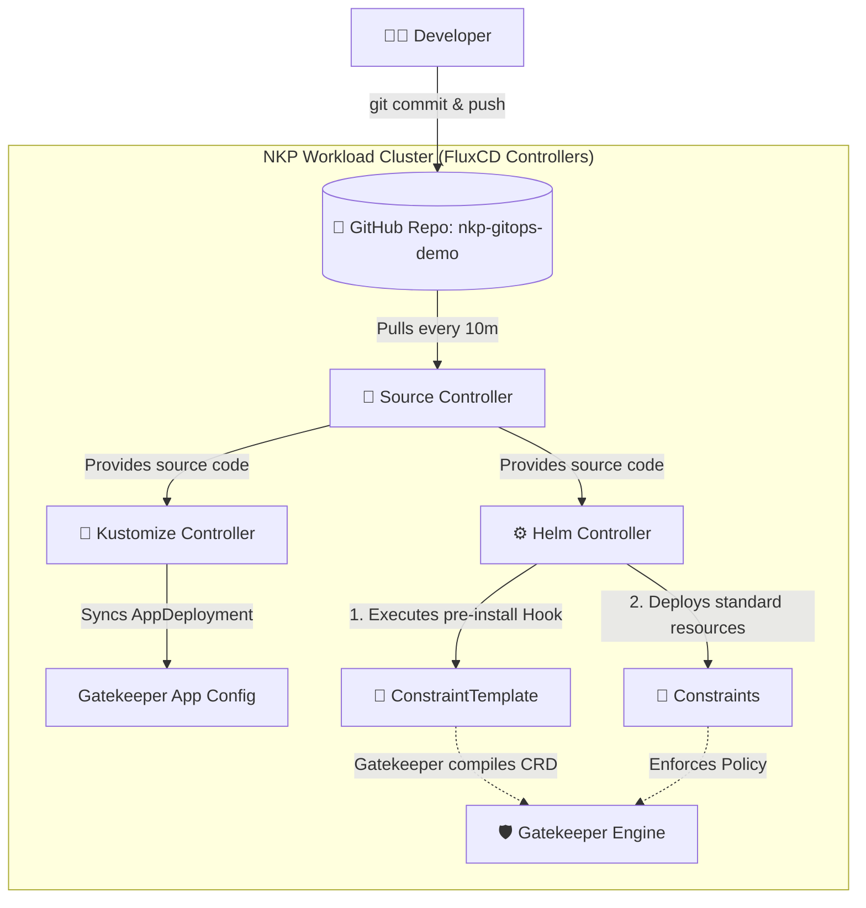

# NKP GitOps & Gatekeeper Demo

## 📖 Overview
This repository demonstrates a best-practice GitOps workflow for managing Nutanix Kubernetes Platform (NKP) platform applications and Gatekeeper security policies using FluxCD and Kustomize.

This implementation is specifically designed for an **NKP Starter** license environment. In a typical NKP Starter setup involving both a Management cluster and attached Workload clusters, this GitOps configuration is applied directly to your target Workload cluster where the policies need to run. We use a custom, logically isolated namespace (`nkp-user-gitops`) to link a dedicated Flux deployment to this repository—preventing collisions with NKP's internal lifecycle managers.

### ⚠️ Why We Moved to Helm (From Flux `dependsOn`)
Gatekeeper policies introduce a classic **"Chicken and Egg" problem**:
1. You cannot apply a `Constraint` until the `ConstraintTemplate` has been compiled by Gatekeeper.
2. If you try to apply both simultaneously, the Kubernetes API will reject the `Constraint` because it doesn't recognize the Custom Resource yet, causing a `dry-run failed` error.

**The Old Way (Flux `dependsOn`):** Previously, we solved this by splitting our manifests into separate `templates/` and `constraints/` directories. We then created multiple Flux Kustomization sync jobs and used the `--depends-on` flag to force Flux to wait for the templates to finish deploying before looking at the constraints. This worked, but it created unnecessary complexity, multi-sync management overhead, and scattered our related policies across different folders.

**The New Way (Helm Hooks):** We have moved to **Helm**. By packaging our Gatekeeper policies into a single Helm chart, we can consolidate everything into one folder. We use native **Helm Hooks** (annotating the `ConstraintTemplate` with `"helm.sh/hook": pre-install, pre-upgrade` and a negative weight). This tells Helm to push the template to the cluster and wait for it to be accepted *before* applying the standard `Constraint` resources. This replaces the complex multi-sync Flux Kustomization setup with a single, highly portable artifact.

---

## 🗂️ Repository Structure

Because we are using Helm for the policies (while keeping Kustomize for the NKP AppDeployments), our repository is strictly organized to handle both correctly:

```text
nkp-gitops-demo/
├── clusters/
│   └── nkp-starter/
│       ├── apps/
│       │   ├── gatekeeper-config.yaml       # ConfigMap with custom values
│       │   └── kustomization.yaml           # Kustomize entrypoint (applies patch)
│       └── charts/
│           └── nkp-gatekeeper-policies/     # Our new consolidated Helm Chart
│               ├── Chart.yaml
│               └── templates/
│                   ├── require-labels-template.yaml   # ConstraintTemplate (Hooked)
│                   └── require-labels-constraint.yaml # Constraint (Standard)
└── README.md

```

### What do the files do?
*   **`apps/gatekeeper-config.yaml` & `kustomization.yaml`**: Injects a `configOverrides` block into NKP's default Gatekeeper `AppDeployment` to change settings without hardcoding application versions.
*   **`charts/nkp-gatekeeper-policies/`**: A self-contained Helm chart containing both our `ConstraintTemplates` (the logic) and `Constraints` (the enforcement). Helm's internal hook engine safely manages the deployment order.

---

## 🏗️ Architecture & GitOps Workflow
Below is the workflow of how code moves from this repository into the NKP Workload cluster, utilizing FluxCD's controllers and Helm.



---

## 🚀 Deploying the Helm Chart

If you want to apply the configuration from this repository to your NKP Workload Cluster, follow these steps to bootstrap Flux. Ensure your `kubectl` context is pointing to your Workload Cluster.

1. **Set your credentials and branch variables:**

```bash
export GITHUB_TOKEN="<your-pat>"
export GITHUB_USER="<your-username>"
export REPO_NAME="nkp-gitops-apps-demo"
export TARGET_BRANCH="unlicensedhelmrelease/v1.0"
```

2. **Create the isolated Namespace and Git Source:**

```bash
kubectl create namespace nkp-user-gitops

flux create secret git github-auth \
  --url=https://github.com/${GITHUB_USER}/${REPO_NAME}.git \
  --username=${GITHUB_USER} \
  --password=${GITHUB_TOKEN} \
  --namespace=nkp-user-gitops

flux create source git nkp-infra-repo \
  --url=https://github.com/${GITHUB_USER}/${REPO_NAME}.git \
  --branch=${TARGET_BRANCH} \
  --secret-ref=github-auth \
  --namespace=nkp-user-gitops

```

3. **Apply the Core Gatekeeper Apps Patch via Kustomization:**

```bash
flux create kustomization nkp-apps-sync \
  --source=GitRepository/nkp-infra-repo \
  --path="./clusters/nkp-starter/apps" \
  --prune=true \
  --interval=10m \
  --namespace=nkp-user-gitops

```

4. **Deploy the Gatekeeper Policies via HelmRelease:**
This tells the Flux Helm Controller to pull our `nkp-gatekeeper-policies` chart. The controller will natively respect the Helm hooks and deploy the resources in the correct order.

```bash
cat <<EOF | kubectl apply -f -
apiVersion: helm.toolkit.fluxcd.io/v2beta1
kind: HelmRelease
metadata:
  name: nkp-gatekeeper-policies
  namespace: nkp-user-gitops
spec:
  interval: 5m
  chart:
    spec:
      chart: ./clusters/nkp-starter/charts/nkp-gatekeeper-policies
      sourceRef:
        kind: GitRepository
        name: nkp-infra-repo
      interval: 1m
EOF

```

---

## ✅ Verification & Teardown

Once deployed, verify that the policies are active:

1. **Check Flux HelmRelease status:**

   ```bash
   kubectl get helmrelease nkp-gatekeeper-policies -n nkp-user-gitops
   # STATUS should be "Release reconciliation succeeded"

   ```
2. **Verify Gatekeeper Resources:**

   ```bash
   kubectl get constrainttemplates k8srequiredlabels
   kubectl get k8srequiredlabels ns-must-have-nkp-managed

   ```
3. **Test the Enforcement (Rejection):**

   ```bash
   kubectl create namespace missing-label-test
   # Expected: Error from server (Forbidden) ... validation.gatekeeper.sh denied the request.

   ```

### Clean Uninstall
Because we deployed this using GitOps, removing the Flux tracking resources will prompt the cluster to automatically delete the underlying Helm release and Kustomize patches:

```bash
kubectl delete helmrelease nkp-gatekeeper-policies -n nkp-user-gitops
kubectl delete kustomization nkp-apps-sync -n nkp-user-gitops
kubectl delete gitrepository nkp-infra-repo -n nkp-user-gitops
kubectl delete namespace nkp-user-gitops

```