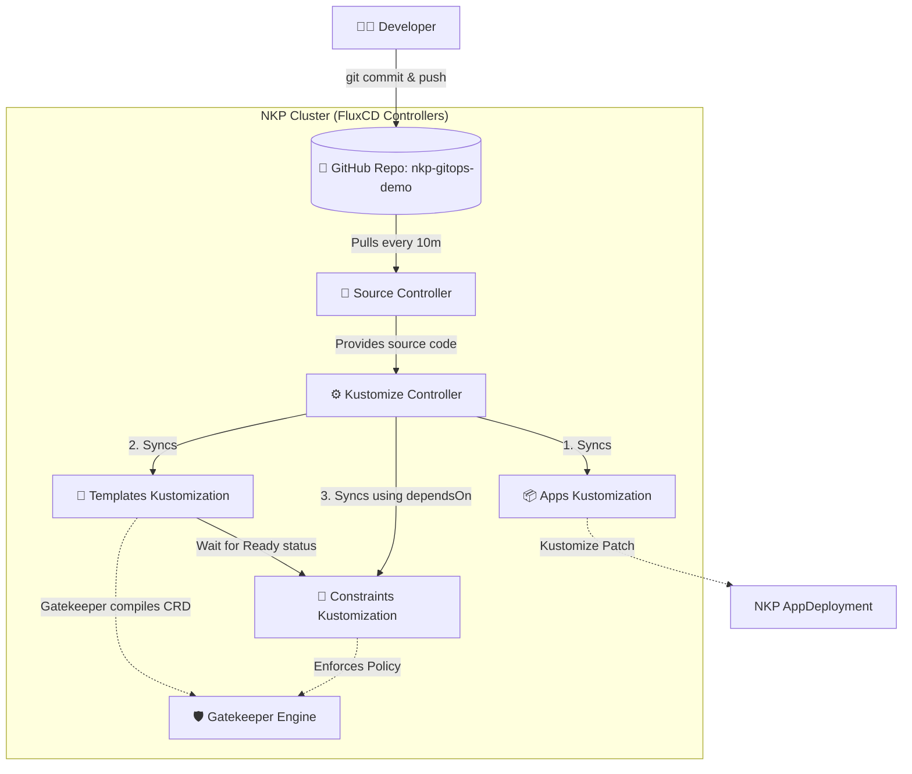

# NKP GitOps & Gatekeeper Demo

This repository demonstrates a best-practice GitOps workflow for managing Nutanix Kubernetes Platform (NKP) platform applications and Gatekeeper security policies using FluxCD and Kustomize.

## 🗂️ Repository Structure

To solve Kubernetes "Chicken and Egg" race conditions, this repository is strictly organized into separate directories based on resource dependencies. The root `kustomization.yaml` has been removed to prevent Flux from syncing everything simultaneously.

```text
nkp-gitops-demo/
├── clusters/
│   └── nkp-starter/
│       ├── apps/
│       │   ├── gatekeeper-config.yaml       # ConfigMap with Helm values
│       │   ├── gatekeeper-patch.yaml        # AppDeployment patch
│       │   └── kustomization.yaml           # Kustomize entrypoint (applies patch)
│       ├── templates/
│       │   ├── require-labels-template.yaml # Gatekeeper ConstraintTemplate (The Logic)
│       │   └── kustomization.yaml           # Kustomize entrypoint for templates
│       └── constraints/
│           ├── require-labels-constraint.yaml # Gatekeeper Constraint (The Enforcement)
│           └── kustomization.yaml             # Kustomize entrypoint for constraints
└── README.md
```

### What do the files do?
*   **`apps/gatekeeper-config.yaml`**: Contains a `ConfigMap` with our custom Helm values (e.g., `auditInterval: 300`).
*   **`apps/gatekeeper-patch.yaml`**: A Kustomize patch targeting NKP's default Gatekeeper `AppDeployment`. It safely injects the ConfigMap overrides *without* hardcoding or locking the application version, allowing NKP upgrades to proceed normally.
*   **`templates/...`**: Contains Gatekeeper `ConstraintTemplates`. These contain the underlying Rego code (the logic) for our policies. When applied, Gatekeeper compiles them and dynamically creates new Kubernetes Custom Resource Definitions (CRDs).
*   **`constraints/...`**: Contains Gatekeeper `Constraints`. These are the actual instantiations of the templates (e.g., "Require the `nkp-managed` label on all Namespaces").
*   **`kustomization.yaml`**: Found in every sub-directory. This is the "manifest" that tells Flux exactly which YAML files in that specific folder should be bundled together and applied to the cluster.

---

## 🏗️ Architecture & GitOps Workflow

Below is the workflow of how code moves from this repository into the NKP cluster, utilizing FluxCD's controllers and Kustomize.



### The Technology Stack Explained

#### 1. Kustomize (The Packager & Patcher)
Kustomize is a configuration management tool built into Kubernetes. Instead of using complex Helm templating, Kustomize works by overlaying "patches" on top of raw YAML. 
In this repo, we use Kustomize to dynamically inject a `configOverrides` block into NKP's default Gatekeeper `AppDeployment`. This allows us to change Gatekeeper's settings without overwriting the application version managed by NKP.

#### 2. FluxCD (The GitOps Engine)
FluxCD runs inside the NKP cluster and continuously monitors this Git repository. It consists of two main pieces:
*   **Source Controller**: Connects to GitHub, authenticates, and downloads the latest `main` branch code into the cluster.
*   **Kustomize Controller**: Looks at the downloaded code, runs Kustomize to stitch the YAML files together, and safely applies them to the Kubernetes API.

#### 3. The `dependsOn` Flag (Solving the Race Condition)
Gatekeeper policies introduce a classic "Chicken and Egg" problem:
1. You cannot apply a `Constraint` until the `ConstraintTemplate` has been compiled by Gatekeeper. 
2. If Flux tries to apply both at the same time, the Kubernetes API will reject the `Constraint` because it doesn't recognize the Custom Resource yet, causing a `dry-run failed` error.

**The Solution:** We split the files into the `templates/` and `constraints/` folders. When configuring Flux, we create separate sync jobs and use the `dependsOn` feature:
```bash
flux create kustomization nkp-constraints-sync \
  ...
  --depends-on=nkp-templates-sync
```
This tells Flux: *"Do not even look at the `constraints` folder until the `templates` folder has successfully deployed and reported a healthy, ready status."* 

---

## 🚀 Getting Started

If you are cloning this repository to run on your own NKP cluster, follow these steps to bootstrap the Flux configuration:

1. **Set your credentials:**
   ```bash
   export GITHUB_TOKEN="<your-pat>"
   export GITHUB_USER="<your-username>"
   export REPO_NAME="nkp-gitops-demo"
   ```

2. **Create the Git Source:**
   ```bash
   kubectl create namespace nkp-user-gitops
   flux create secret git github-auth --url=https://github.com/${GITHUB_USER}/${REPO_NAME}.git --username=${GITHUB_USER} --password=${GITHUB_TOKEN} --namespace=nkp-user-gitops
   flux create source git nkp-infra-repo --url=https://github.com/${GITHUB_USER}/${REPO_NAME}.git --branch=main --secret-ref=github-auth --namespace=nkp-user-gitops
   ```

3. **Apply the Apps & Templates:**
   ```bash
   flux create kustomization nkp-apps-sync --source=GitRepository/nkp-infra-repo --path="./clusters/nkp-starter/apps" --prune=true --interval=10m --namespace=nkp-user-gitops
   flux create kustomization nkp-templates-sync --source=GitRepository/nkp-infra-repo --path="./clusters/nkp-starter/templates" --prune=true --interval=10m --namespace=nkp-user-gitops
   ```

4. **Apply the Constraints (with dependsOn):**
   ```bash
   flux create kustomization nkp-constraints-sync --source=GitRepository/nkp-infra-repo --path="./clusters/nkp-starter/constraints" --prune=true --interval=10m --depends-on=nkp-templates-sync --namespace=nkp-user-gitops
   ```

## ✅ Verification
Check that the policy is active by attempting to create a non-compliant namespace:
```bash
kubectl create namespace test-bad-ns
# Should return: Error from server (Forbidden): admission webhook "validation.gatekeeper.sh" denied the request...
```

